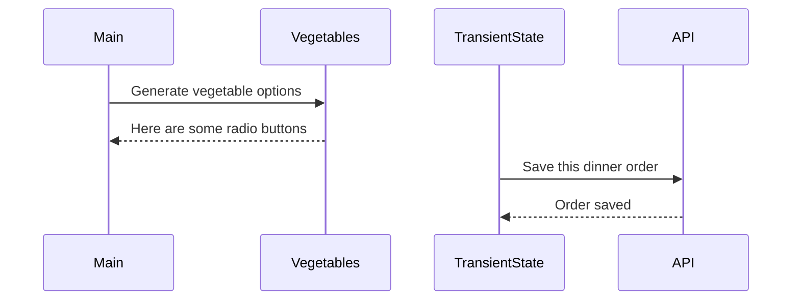

# Events and State Self-Assessment

> 🧨 Make sure you answer the vocabulary and understanding questions at the end of this document before notifying your coaches that you are done with the project

## Setup

1. Make sure you are in your `workspace` directory
1. `git clone {github repo SSH string}`
1. `cd` into the directory it creates
1. `code .` to open the project code
1. Use the `serve` command to start the web server
1. Open the URL provided in Chrome

## Requirements

### Initial Render

1. All 10 base dishes should be displayed as radio input options.
1. All 9 vegetables should be displayed as radio input options.
1. All 6 side dishes should be displayed as radio input options.
1. All previously purchases meals should be displayed below the meal options. Each purchase should display the primary key and the total cost of the purcahsed meal.

### State Management

1. When the user selects an item in any of the three columns, the choice should be stored as transient state.
1. When a user makes a choice for all three kinds of food, and then clicks the "Purchase Combo" button, a new sales object should be...
    1. Stored as permanent state in your local API.
    1. Represented as HTML below the **Monthly Sales** header in the following format **_exactly_**. Your output will not have zeroes, but the actual amount.
        ```html
        Receipt #1 = $00.00
        ```
   1. The user's choices should be cleared from transient state once the purchase is made.

## Design

Given the description and animation above...

1. Create an ERD for this application before you begin.
1. Make a list of what modules need to be created to make your application as modular as possible. Create a **Dependency Graph** for the project to be reviewed once you are complete with the assessment.
1. Create a **Sequence Diagram** that visualizes what your algorithm is for this project. We'll give you a minimal starting point.



## Vocabulary and Understanding

> 🧨 Before you click the "Assessment Complete" button on the Learning Platform, add your answers below for each question and make a commit. It is your option to request a face-to-face meeting with a coach for a vocabulary review.

1. Should transient state be represented in a database diagram? Why, or why not?
   > No, since transient state is just a temporary holder of information before it is posted to the actual database, and is reset after each post, it should not be represented in the database diagram.

2. In the **FoodTruck** module, you are **await**ing the invocation of all of the component functions _(e.g. sales, veggie options, etc.)_. Why must you use the `await` keyword there? Explain what happens if you remove it.
   > We have to use await because each of those component functions is an async method that is asynchronously retrieving information from our api (the database.json). If we did not await them, they would return a pending promise, not the html we're expecting. 

3. When the user is making choices by selecting radio buttons, explain how that data is retained so that the **Purchase Combo** button works correctly.
   > There is an event listener added to the DOM that is listening for all "change" events (the event that is triggered by selecting a radio button). The target of that event (the radio button element) includes the relevant data for creating a new order, the id and name of the input. Those two values are used to update the correct key of the transient state (pendingOrder). The target.name is used to identify the correct object key within pendingOrder whose value will be set to the target.id (the foreign key that will be used to identify the corresponding entry in it's related table). Those values are stored (or updated if the user makes a different choice) until the Purchase Combo button is clicked and the transient state (pendingOrder) is posted to the database. 
   

4. You used the `map()` array method in the self assessment _(at least, you should have since it is a learning objective)_. Explain why that function is helpful as a replacement for a `for..of` loop.
   > I ended up using the forEach array method instead of map (in RadioSelection.js & Sales.js), just because the way I ended up generating my html was by adding a new section of html string for each choice/sale. Since I didn't need to return a new array, the forEach method worked better for me. 

   However, the map method is a nice replacement for a for...of loop because it returns an array. In a for...of loop we could create an html string for each option/sale and then push it to an array. Instead, the map method returns an array of all the values that were returned by the callback function passed to the method. In this case, an html string for each iterated option/choice. So if you're using a for...of loop to push items to an array, you might as well just use the map method instead. 

   let htmlArray = []
   for (const option of options) {
      htmlArray.push(`<input type="radio" id=${option.id}>${option.name}</input>`)
   }

   vs

   let htmlArray = options.map((option) => {return `<input type="radio" id=${option.id}>${option.name}</input>`})


